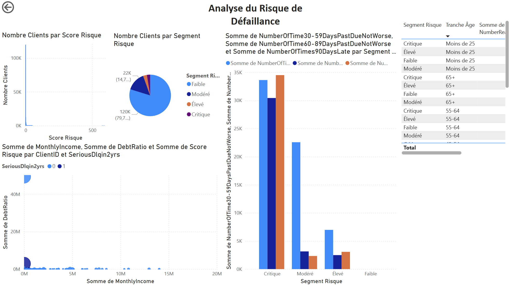
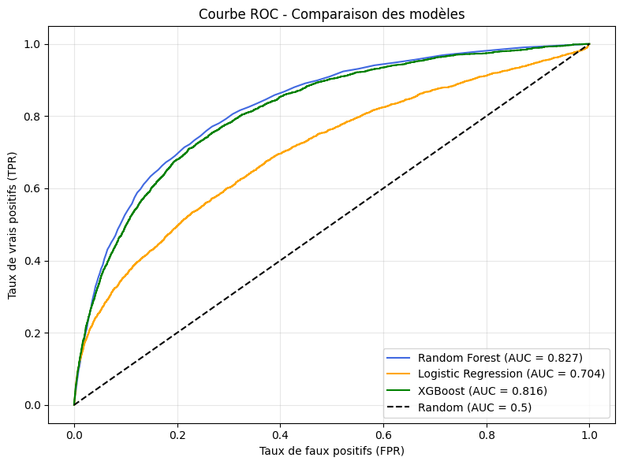
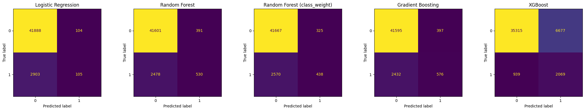
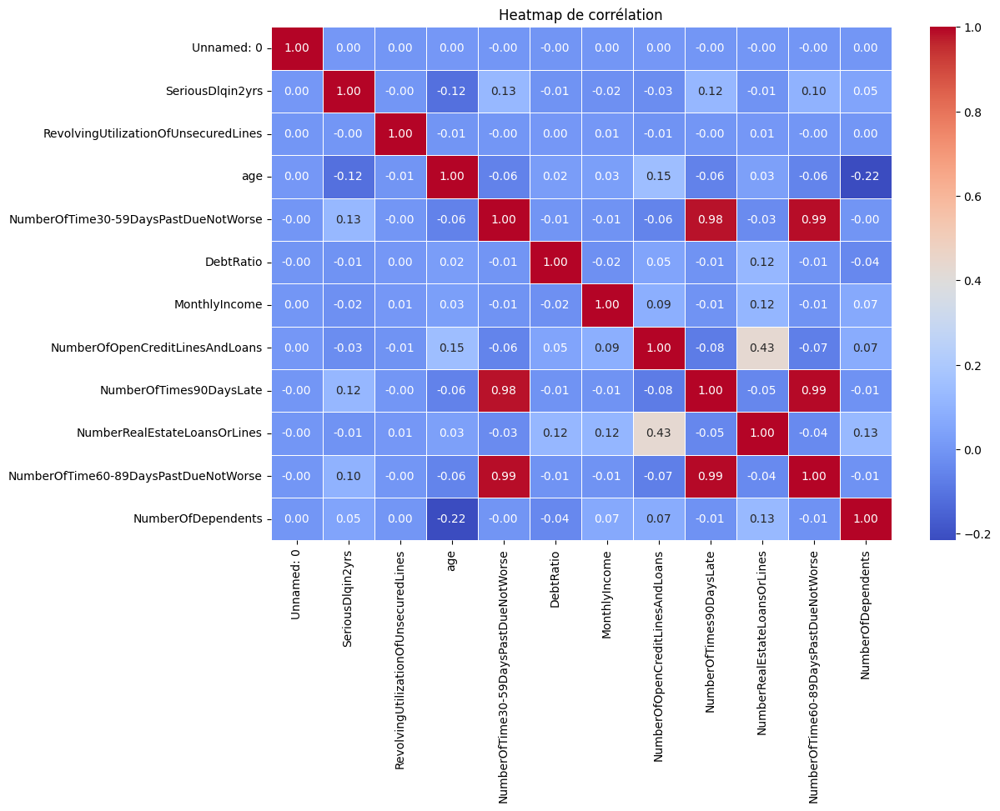

# Finance Analytics - Credit Scoring

## Introduction
Ce projet fait partie de mon portfolio spécialisé en data science appliquée à la finance. Il illustre ma capacité à manipuler des données sensibles, construire des modèles robustes et les interpréter dans un cadre métier.

## Description
Ce projet vise à développer un modèle de scoring de crédit capable d'identifier les clients à risque de défaut de paiement grave. En utilisant des techniques avancées de machine learning et de gestion des déséquilibres de classes, le modèle atteint des performances élevées tout en offrant des insights précieux pour les équipes de gestion du crédit.

## Résumé métier
- **Objectif** : Identifier les clients à risque de défaut de paiement grave.
- **Résultats clés** :
  - Après équilibrage des classes (SMOTE), le rappel pour la classe à risque dépasse **44%**.
  - Les variables les plus prédictives incluent les retards de paiement passés et le nombre de personnes à charge.
  - L’accuracy globale atteint près de **90%** sur l’ensemble de test, dépassant le seuil attendu de **85%**.
  - Le modèle aide les équipes crédit à mieux cibler les clients à surveiller, tout en limitant les faux positifs.

## Dataset
Le dataset utilisé contient des informations financières et démographiques des clients, notamment :
- **SeriousDlqin2yrs** : Indique si un individu a eu des défauts graves de paiement au cours des 2 dernières années.
- **RevolvingUtilizationOfUnsecuredLines** : Utilisation des lignes de crédit non garanties.
- **age** : Âge de l'individu.
- **DebtRatio** : Ratio de la dette totale par rapport au revenu mensuel.
- **MonthlyIncome** : Revenu mensuel.
- **NumberOfDependents** : Nombre de personnes à charge.

## Contexte métier
Les institutions financières doivent anticiper le risque de défaut pour protéger leurs portefeuilles de crédit. Ce projet simule une situation réelle où l’objectif est de construire un modèle prédictif capable d’évaluer la probabilité qu’un client fasse défaut de paiement dans les deux prochaines années, en s’appuyant sur des données historiques. Cette approche peut être utilisée pour automatiser la prise de décision dans l’octroi de crédit ou ajuster le taux d’intérêt.

## Méthodologie
1. **Prétraitement des données** :
   - Gestion des valeurs manquantes (imputation par la médiane).
   - Normalisation des variables continues.
2. **Gestion du déséquilibre des classes** :
   - Utilisation de la technique **SMOTE** pour sur-échantillonner la classe minoritaire.
3. **Modélisation** :
   - Test de plusieurs modèles : Régression Logistique, Random Forest, Gradient Boosting, XGBoost.
   - Évaluation des performances avec des métriques telles que l'accuracy, le rappel, et l'AUC.
4. **Optimisation** :
   - Ajustement des seuils de décision pour améliorer le compromis précision/rappel.

## Résultats
- **Modèle final** : Random Forest avec SMOTE.
- **Performances** :
  - Accuracy : **90%**.
  - Rappel pour la classe à risque : **44%**.
  - AUC : **0.88**.

## Visualisations
- Courbes ROC pour comparer les modèles.

- Matrices de confusion pour analyser les prédictions.

- Heatmap des corrélations entre les variables.

## Contributions
Les contributions sont les bienvenues ! Veuillez soumettre une pull request ou ouvrir une issue pour toute suggestion ou amélioration.

Applicattion : https://finance-analytics---credit-scoring.streamlit.app/
Dashboard: https://app.powerbi.com/groups/me/reports/1247c610-71ea-4df2-b8cc-b71f992e27aa/1bdb29f134b7576fc281?experience=power-bi

Auteur : Yendi Yohann